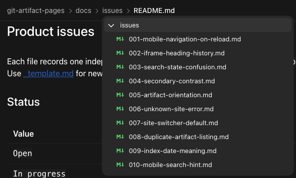
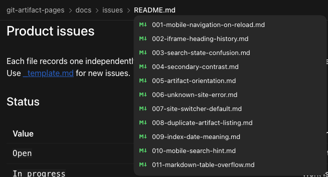

# Browse sibling artifacts from path breadcrumbs

- Status: Done
- Priority: P2
- Area: Artifact workspace breadcrumb navigation

## Problem

The artifact path shows where a document lives, but it does not offer a quick way to inspect nearby files and folders. Today, selecting a path segment reveals its location in the sidebar. When the sidebar is collapsed or overlaid on mobile, moving to a sibling artifact requires opening and traversing that separate navigation surface.

## Evidence and reproduction

1. Open a nested artifact such as `/showcase/editorial/field-notes/index.html` and select a folder or filename in the header path.
2. The current breadcrumb action reveals the location in the sidebar; it does not show nearby artifacts beside the selected path segment.
3. The user-supplied references illustrate a compact menu from a [folder breadcrumb](assets/012-folder-breadcrumb-menu.png) and a sibling-file list from a [file breadcrumb](assets/012-file-breadcrumb-menu.png). These screenshots are a proposed interaction, not evidence of current product behavior.

## Expected outcome

A reader can open a path segment, understand its nearby folders and artifacts, and jump to a sibling without losing reading context. The menu should use logical site routes and artifact titles where available, while preserving the exact filename when it helps distinguish similar documents.

## Acceptance criteria

- [x] A folder breadcrumb provides an anchored menu for navigating the relevant folder's children or nearby artifacts.
- [x] The current-file breadcrumb provides a way to choose a sibling artifact and clearly marks the current item.
- [x] Selecting an artifact navigates to its logical `/:site/*` URL and closes the menu.
- [x] The interaction works with keyboard and touch, including focus, Escape, and long lists on narrow screens.
- [x] The existing ability to locate an artifact in the sidebar remains available through a clear route.

## Verification

- `npm run build`
- Playwright: folder and sibling menus, route selection and history changes, focus and Escape, sidebar reveal and focus handoff, keyboard and touch selection, and a long mobile list
- Full Playwright suite: 33 tests passed
- Browser visual check at desktop and 390 px widths

## Design references

