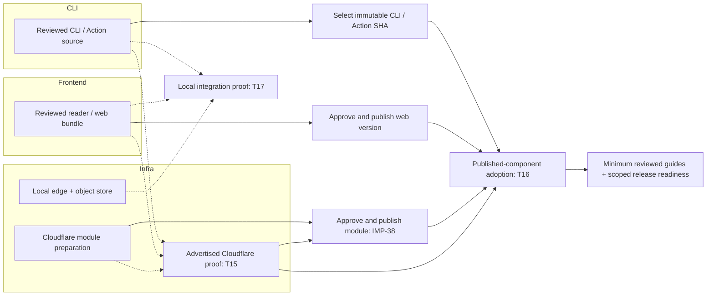

# Component lanes and dependency map

[Release execution order](release-readiness.md) · [Delegation and owner handoffs](delegation.md)

Checked on October 2, 2026 (JST). This is a cross-track navigation view, not another ticket queue or specification. Ticket files own status, acceptance criteria and evidence. The lanes below do not change release scope, assign work, or grant external-change authority.

## Keep the axes separate

| Axis | Question answered | Source of truth |
| --- | --- | --- |
| Track | Is this a product problem, implementation slice, design decision, verification, or reader-facing page? | Existing backlog directories and their indexes |
| Component lane | Which component primarily changes, and which other components participate? | The map below; record primary and participating lanes in new or substantially revised tickets |
| Dependency | What outcome must exist before this particular step can finish? | The ticket's dependency or acceptance criteria |
| Execution mode | Can an agent proceed locally, or is an owner handoff needed? | [Delegation](delegation.md) and the ticket |
| Release gate | What evidence or approval is required before advertising or publishing this scope? | [Release readiness](release-readiness.md) |

Keep files in their existing tracks. A cross-component item stays one item, with one primary lane and participating lanes; do not create one copy per component. Verification spans lanes rather than becoming another independently shipped component.

## Lanes

| Lane | Owns | Current entry points |
| --- | --- | --- |
| CLI | Config resolution, registry/content publication, projection generation, concurrency/recovery, preview reconciliation; thin Actions wrapping the same operations | [T5](verification/T5-concurrency-recovery.md), [T14](verification/T14-production-reconciliation.md), [T17](verification/T17-local-preview-retirement-e2e.md), [T18](verification/T18-publish-scale-baseline.md), [T19](verification/T19-publish-state-layout-cost.md); completed implementation records remain historical evidence |
| Frontend | Reading, navigation, discovery/search, preview presentation, loading/error states, web bundle | [IMP-42](implementation/IMP-42-fulltext-search-ux.md), [T6](verification/T6-resources-navigation.md), [issue repair order](issues/README.md#repair-order) |
| Infra | Local edge/object-store profiles, provider adapters, delivery/cache/CSP, lifecycle rules, Terraform module packaging | [IMP-37](implementation/IMP-37-cloudflare-entry-module.md), [IMP-38](implementation/IMP-38-terraform-registry-publication.md), [IMP-39](implementation/IMP-39-aws-cloudflare-dns-acm.md), [T15](verification/T15-provider-delivery.md) |
| Docs / Adoption | Obtainable versions, consumer setup, public documentation and owner review | [T16](verification/T16-external-adoption.md), [documentation queue](documentation/README.md) |

Docs / Adoption is a cross-cutting workstream, not a fourth runtime component. A defect can originate in any lane; use the issue's evidence to determine its primary component rather than assigning all issues to Frontend.

## Dependency meanings

- **Requires:** a hard prerequisite for the named step. State the required outcome, not merely another ticket ID. A completed prerequisite does not remain a blocker.
- **Verified by:** a test or measurement consumes several components to prove a shared contract. This does not imply that all component development must run sequentially.
- **Release gate:** package preparation may proceed, but publication or a support claim waits for the specified proof/approval.
- **Related:** context only; do not infer a blocker.

If a ticket currently lists several meanings together under `Depends on`, preserve its accepted constraints and clarify the relation when revising that ticket. This overview does not silently remove existing gates.

## Shared proofs

| Proof | Primary lane | Participating lanes | Required outcome / boundary |
| --- | --- | --- | --- |
| [T17: local preview retirement](verification/T17-local-preview-retirement-e2e.md) | CLI | Frontend, Infra | Actual CLI publication and reconciliation + local object-store deletion + warm-browser withdrawal. Existing local infrastructure is the foundation; no cloud expiry wait or new cleanup workflow. |
| [T18: publisher scale baseline](verification/T18-publish-scale-baseline.md) | CLI | Infra | Compare state-assisted fast-path and explicit-origin-reconciliation behavior with the recorded in-memory and pre-change Cloudflare baseline; candidate provider results remain pending, and CLI changed-object counts do not stand in for adapter request/byte metrics. |
| [T19: publish-state layout and provider cost](verification/T19-publish-state-layout-cost.md) | CLI | Infra | Compare the current flat state and safe directory/shard prototypes against identical real builder outputs, including recovery and retained-state cost; provider pricing models stay separate from measured provider-wire requests and common projection work. |
| [T4: serving/cache](verification/T4-serving-boundary.md) and [T6: resources/navigation](verification/T6-resources-navigation.md) | Frontend | CLI, Infra | Published artifacts/resources are served and navigated under the accepted HTTP/trust contract. Local proof does not establish live-provider behavior. |
| [T5: concurrency](verification/T5-concurrency-recovery.md) and [T14: production reconciliation](verification/T14-production-reconciliation.md) | CLI | Infra | Correct operation under conditional writes, retries, interruptions and competing publication. Provider-specific evidence stays distinct. |
| [T8: stale references](verification/T8-stale-reference-cleanup.md) | CLI | Frontend, Infra | Missing-object reconciliation and reader behavior; T17 provides a repeatable local integration proof, while lifecycle behavior remains provider evidence. |
| [T15: provider delivery](verification/T15-provider-delivery.md) | Infra | CLI, Frontend | Real delivery/publication/lifecycle evidence for each advertised provider. Cloudflare, AWS and emulator-only GCP must not be collapsed into one support claim. |
| [T16: external adoption](verification/T16-external-adoption.md) | Docs / Adoption | CLI, Frontend, Infra | A clean consumer (new public repository, separate Cloudflare bucket) follows only the public guide and uses the independently versioned released CLI, web bundle, Actions and Cloudflare module, then proves setup and web upgrade/rollback. Local smoke candidates are preparation, not published-component adoption. |

## Release convergence, not a single serial queue

Solid arrows below mean a prerequisite for that convergence step. Dotted arrows mean inputs to a shared proof. They are not a calendar or new blanket requirement to complete every listed ticket before any release.

Module packaging, web packaging, Action pin preparation and documentation drafts can progress in parallel. The diagram groups owner approvals with their publication step; it does not grant that approval. Public guide finalization must describe the tested, obtainable components, but drafting need not wait for publication.

CLI/Actions use an immutable source SHA; web bundles have their own versions; Terraform modules have independent per-module SemVer, released by per-module tags and synced to generated package repositories ([TD15](technical-design/TD15-terraform-module-source-of-truth.md), [TD2](technical-design/TD2-component-release-policy.md), [IMP-38](implementation/IMP-38-terraform-registry-publication.md)). There is no umbrella version or automatic app redeployment for a CLI-only change.

AWS composition/proof is a separate Infra branch. It does not block a scoped Cloudflare-first release. GCP remains emulator-only. IMP-42 can advance in the Frontend lane independently; this map does not newly designate it or unrelated UI polish an initial-release gate.

## How to use this view

1. Find work in the existing track/repair queue, then identify its primary lane and participating lanes.
2. Read the required outcome of each dependency. Distinguish implementation prerequisites from verification and publication gates.
3. Delegate independent local work in parallel within the existing owner boundaries. Shared files still require coordination even when tickets belong to different lanes.
4. Record results/status in the ticket and synchronize its track index. Update this map only when relationships or scope change, not for every status transition.
5. Follow release readiness for the next external handoff. A green component lane alone does not establish end-to-end adoption readiness.
